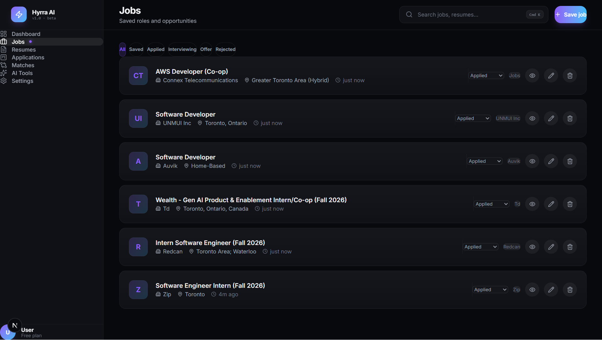
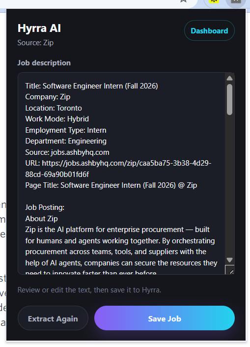

# Hyrra AI — AI Job Intelligence & Application Engine

> **Repository Note**: This repository serves as a **product showcase and architectural case study** for Hyrra AI. The core implementation source code is private.

## Overview
Hyrra AI is a comprehensive, AI-powered job application copilot built for modern professionals. It bridges the gap between discovering a job on a career site and submitting a highly tailored application. By combining intelligent text extraction, deterministic matching algorithms, and LLM-powered enrichment, Hyrra AI helps users understand exactly how their resume aligns with a job posting and provides actionable steps to improve their chances.

## The Problem
The modern job search is fragmented and tedious. Candidates must manually track jobs across multiple boards, guess which skills an ATS system will prioritize, and spend hours drafting custom cover letters. Existing tools often trap users in walled gardens or require them to surrender their private data.

## The Solution
Hyrra AI provides a local-first, BYOK workflow for the MVP. Using a dedicated Chrome extension, users can instantly ingest job descriptions from any career page into their personal dashboard. The platform then parses the job, compares it against the user's stored resumes, generates a strict ATS match score, and uses AI to explain skill gaps and draft personalized cover letters.

## Key Features
- **Instant Job Ingestion**: Extract job descriptions directly from any website via the Chrome Extension MVP.
- **Smart Resume Parsing**: Upload PDFs or paste raw text to automatically extract skills, projects, and qualifications.
- **Deterministic Match Scoring**: Instantly view how well a resume aligns with a job description based on strict, word-boundary-aware skill matching.
- **AI Match Explanation**: Understand exactly why a match score was given, with AI-generated feedback on strengths, weaknesses, and improvement suggestions.
- **Cover Letter Generation**: Automatically draft context-aware cover letters tailored specifically to the intersection of the job's requirements and the candidate's experience.
- **Application Tracking**: A built-in Kanban board to track the lifecycle of every application from "Saved" to "Offer".

## Screenshots

### Dashboard

The Hyrra AI dashboard centralizes saved jobs, resumes, match results, AI tools, and application tracking in one workspace.

### Chrome Extension

The Chrome extension extracts visible job posting text and metadata from live career pages, lets the user review or edit the extracted content, and saves the job directly into Hyrra AI.

## System Architecture

The system is decoupled into a frontend presentation layer, a stateless extraction/enrichment backend, and a persistence layer.

- **Chrome Extension MVP**: Injects into the active tab to extract visible job posting text. Allows users to preview and edit the payload before transmitting it to the backend API.
- **Backend (FastAPI)**: Serves as the core engine. It normalizes incoming text, extracts structured profiles using a deterministic approach, computes match scores, and handles optional OpenAI API enrichments.
- **Frontend Dashboard (Next.js)**: A responsive, highly polished user interface that provides a unified view of the job search pipeline.
- **Database (SQLite)**: A lightweight, local-first storage layer managing core entities: `Job`, `Resume`, `Application`, and `MatchResult`.

## Tech Stack
- **Frontend**: Next.js, React, TypeScript, Tailwind CSS, Lucide Icons
- **Backend**: Python, FastAPI, SQLAlchemy, Pydantic
- **Database**: SQLite (Local-first architecture)
- **AI & Parsing**: OpenAI API (BYOK - Bring Your Own Key), pdfplumber
- **Extension**: Chrome Manifest V3

## Chrome Extension Workflow
1. User navigates to a job posting.
2. User clicks the Hyrra extension, which extracts the main body text.
3. User verifies or edits the text in the extension popup.
4. User clicks "Save Job", storing the job directly in their Hyrra database with the appropriate source label.

## AI Matching & Enrichment
Hyrra uses a two-step approach to matching:
1. **Deterministic Parsing**: A strict regex and word-boundary engine identifies industry-standard skills.
2. **LLM Enrichment**: OpenAI is utilized not for basic parsing, but for high-level reasoning—explaining *why* a candidate is a strong fit and generating targeted application materials.

## Application Tracking
A fully integrated Kanban system allows users to seamlessly move jobs through various stages. Changing a job's status automatically creates or updates the underlying relational Application tracking records.

## Privacy Note
In the MVP, jobs, resumes, and application data are stored locally during development, while OpenAI enrichment is only triggered when the user provides an API key. The API key is used for that request and is not stored by the application.
